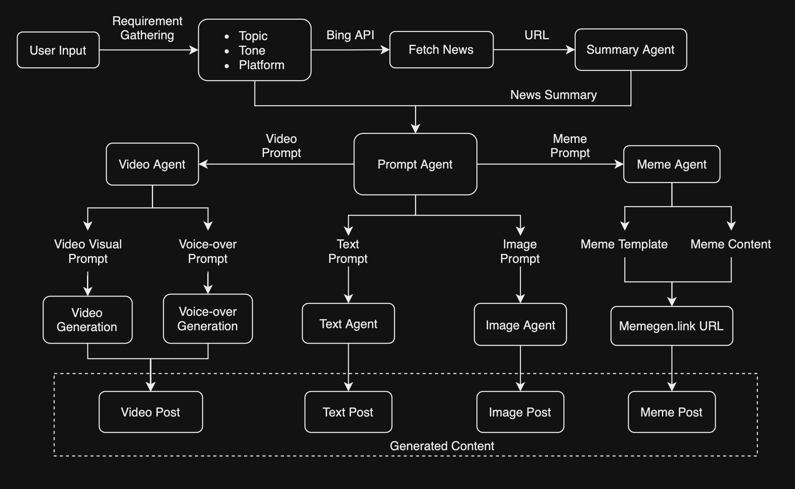

# **Minizica - Daily News Content Generator**

### **Detailed Project Overview**  

The digital age demands smarter solutions to keep pace with the ever-evolving news cycle. At **Minizica**, we’ve crafted an AI platform that not only simplifies the challenge of staying informed but also automates the creation of high-quality content. By integrating cutting-edge AI, our solution provides dynamic, user-customized outputs—be it text posts, memes, visuals, or videos.  

With its open-source foundation, this tool is built to empower individuals and organizations alike, offering a free, efficient, and creative approach to content creation.  

---

### **The Challenge**  

The sheer volume and velocity of news can be overwhelming. Professionals, marketers, and creators face several hurdles:  
- **Finding Focus**: Sifting through endless articles for relevant insights.  
- **Meeting Deadlines**: Balancing speed and quality in manual content creation.  
- **Adapting Across Platforms**: Tailoring messages for diverse audiences and formats.  
- **Staying Creative**: Consistently crafting original, engaging content.  

---

### **Our Vision**  

To bridge these gaps, we’ve developed an autonomous AI solution designed to:  
- **Stay Ahead**: Automatically curate relevant, trending news topics.  
- **Work Smarter**: Summarize, extract insights, and propose creative content ideas.  
- **Adapt Dynamically**: Customize outputs to match specific tones, platforms, and user feedback.  
- **Create Effortlessly**: Deliver diverse formats that are ready for direct use, saving valuable time.  

---

### **What Sets Us Apart?**  

1. **Autonomous Workflow**:  
   - Automatically identifies and prioritizes content sources, adjusting tone and style based on preferences.  

2. **Adaptive Interactions**:  
   - Allows users to refine outputs through follow-up prompts, iterating for optimal results.  

3. **Intelligent Suggestions**:  
   - Recommends trending topics, hashtags, and formats tailored to maximize engagement.  

4. **Dynamic Display**:  
   - A responsive web interface provides real-time previews and easy downloads of generated content.  

5. **Open-Source Innovation**:  
   - Fully free to use and extend, making advanced AI capabilities accessible to all.  

---

### **Core Features**  

1. **Smart News Aggregation**  
   - Fetches fresh, relevant articles using Bing News API with user-defined filters.  

2. **Insightful Summaries**  
   - Condenses articles into concise, actionable insights using Groq-powered NLP.  

3. **Multi-Format Creativity**  
   - **Text**: Generates professional, tone-specific posts for platforms like LinkedIn or Twitter.  
   - **Images**: Designs high-quality visuals using AI image-generation models.  
   - **Memes**: Crafts shareable, creative memes with smart captioning.  
   - **Videos**: Produces engaging short videos with visuals and AI-generated voiceovers.  

4. **Personalized Customization**  
   - Adapts tone, style, and format for diverse audiences and platforms.  

5. **Fully Automated Process**  
   - From idea to final output, minimizes manual intervention while ensuring top-notch quality.  

---

### **Workflow Overview**

The following workflow illustrates how the AI-powered content generation system operates, transforming user inputs into high-quality, multi-format content:

 

1. **Requirement Gathering**:  
   Users primarily provide a complete requirement as input (e.g., "Generate an informative post about renewable energy advancements for a LinkedIn audience"), which is processed by the LLM to extract the necessary parameters such as topic, tone, and platform.  
   Additionally, users can explicitly specify the tone (e.g., "Humorous") and platform (e.g., "LinkedIn") if desired.  
   - **Content Formats**: Users will then select desired output formats such as text, images, memes, or videos.  

2. **News Retrieval**:  
   Using the Bing News API, the system fetches relevant news articles based on the provided topic and filters for recency and relevance.

3. **Summarization**:  
   The **Summary Agent** processes the retrieved articles to generate concise summaries, capturing the key insights.

4. **Prompt Agent**:  
   The **Prompt Agent** acts as the central node, distributing prompts to specialized agents based on the desired content format:
   - **Text Prompt** for text posts.  
   - **Image Prompt** for image creation.  
   - **Video Prompt** for video generation.  
   - **Meme Prompt** for meme production.  

5. **Content Generation**:  
   - **Text Agent**: Generates platform-specific, engaging text posts.  
   - **Image Agent**: Creates visually striking images using AI models.  
   - **Video Agent**: Produces dynamic videos by combining generated visuals with voiceovers.  
   - **Meme Agent**: Crafts shareable memes using templates and captions.  

6. **Dynamic Display**:  
   - Generated content is presented on a responsive landing page.  
   - Users can preview and download the outputs in real-time.  

7. **Iterative Refinement**:  
   - The system supports **multi-turn interaction**, allowing users to refine outputs (e.g., "Make it more humorous" or "Focus on AI ethics").  

---

### **Demo Screenshots**

1. **User Input Interface**  
   An intuitive interface where users provide their content requirements, select tone, platform, and desired formats.  

2. **Generated Content Previews**  
   Real-time previews of the generated text, images, memes, and videos, tailored to user specifications with options to download or refine outputs through follow-up prompts.  

---

### **Limitations and Future Enhancements**

While Minizica offers powerful AI-driven content generation, certain limitations highlight areas for improvement, and planned enhancements aim to make the platform more robust and scalable:  

1. **Infrastructure and Scalability**  
   - **Current Limitation**: Operates on a single deployment setup, which may limit performance during high traffic.  
   - **Enhancement**: Introduce scalable deployment options like AWS or Heroku to handle larger user loads efficiently.  

2. **Language Support**  
   - **Current Limitation**: Supports content creation only in English, restricting its global reach.  
   - **Enhancement**: Expand to multilingual support to cater to a diverse audience.  

3. **Fine-Tuned LLMs and Content Generation**  
   - **Current Limitation**: Relies on external LLM inference (e.g., Groq, Hugging Face), leading to performance bottlenecks and dependency risks.  
   - **Enhancement**: Fine-tune LLMs specifically for Minizica's use cases and run them locally or on dedicated servers to enhance efficiency, reduce latency, and eliminate reliance on external services.  

4. **Analytics and Insights**  
   - **Current Limitation**: Lacks advanced analytics, such as engagement predictions or platform-specific optimization.  
   - **Enhancement**: Integrate insights and analytics to guide users on content performance and trends, providing actionable recommendations.  

5. **Workflow Optimization**  
   - **Current Limitation**: The content generation pipeline could be faster and more efficient.  
   - **Enhancement**: Streamline workflows to reduce latency, improve speed, and ensure high-quality outputs consistently.  

6. **Personalization and Collaboration**  
   - **Current Limitation**: Limited ability to personalize content based on user preferences and no multi-user support.  
   - **Enhancement**: Develop user profiles to store preferences for tone, style, and platform, and introduce collaboration tools for multi-user projects.  

By addressing these limitations and implementing the outlined enhancements, Minizica aims to evolve into a self-sufficient, scalable, and globally accessible platform that delivers exceptional content creation capabilities tailored to diverse user needs.  

---

### **How to Set Up**

For detailed setup instructions, API requirements, and prerequisites, refer to the [README.md](README.md).  
